# Docker Containerized Restaurant Management App (C# .NETCore)
<ul>
  <li>A Docker Containerized Web Application that allows users to manage employees, dining tables, foods, orders and bills in the restaurant with authentication and role based authorization.</li>
  <li>The app was built with ASP.NET Core3.1 MVC with front-end Views created by Razor and Controllers implemented with Dependency Injection and Async/Await.</li>
  <li>Back-end data was cached using Redis and managed by Microsoft SQL Server using Entity Framework Core (EF Core) and Dapper as Object Relational Mapper (ORM) for handling Authentication/Authorization data and the rest of the app data respectively.</li>
</ul>

<h3>docker-compose defines 4 services: rmui, efcore-mssql, dapper-mssql and redis. rmui packs an ASP.NET Core Web Application into RMUI container based on the image built by Dockerfile inside the RMUI folder. The efcore-mssql container is created by the mssql server pulled from docker hub, which uses Entity Framework Core as ORM to manage the authentication/authorization data. The dapper-mssql container uses Dapper as ORM for managing the rest of the app data. It is created by the image rmdataimg, which is built in advance by dockerfile inside the RMDataBackup folder. The redis container is created by Redis pulled from docker hub.</h3> 
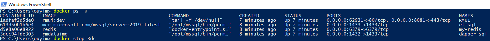

<h3> Home Page with controllers shown as dropdown lists in the menu bar </h3>

<h3>The app supports Authentication and Role Based Authorization, which requires user login to use the app. The code for user role assignment can be found in Home Controller.</h3>

<h3>Person Controller -- inserting new employee into database</h3>

<h3>Person Controller -- editing employee info</h3>

<h3>Person Controller -- viewing all employees. The Create New Employee link and the Edit link allows redirecting to the inserting new employee view and the editing employee view respectively. The Delete link directly deletes the employee.</h3>
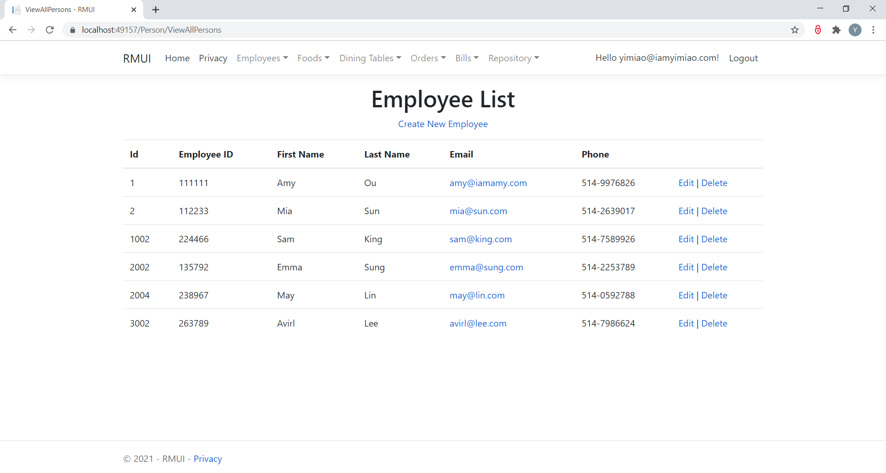

<h3>DiningTable Controller -- inserting new dining table into database</h3>
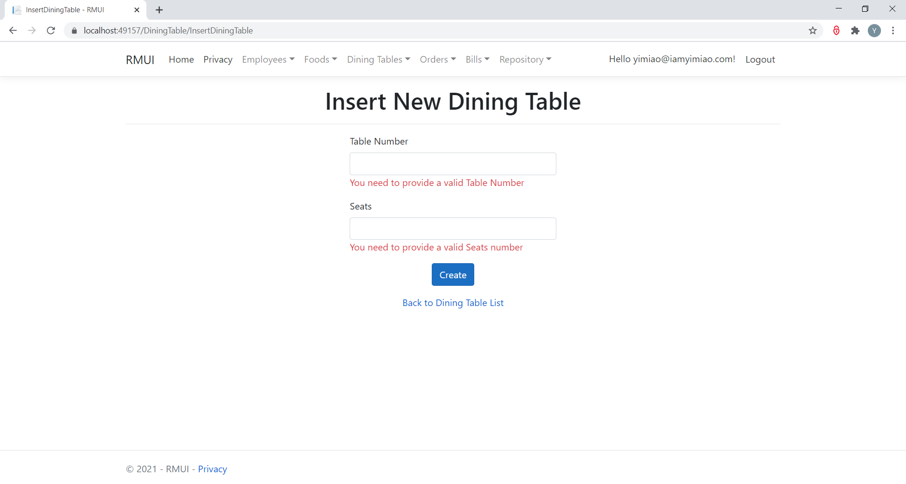

<h3>DiningTable Controller -- editing dining table</h3>

<h3>DiningTable Controller -- viewing all dining tables. The Create New Dining Table link, Edit link and Delete link allows inserting, editing and deleting the dining table respectively.</h3>

<h3>Food Controller -- inserting new food type into database</h3>

<h3>Food Controller -- viewing all food types. The Create New Food Type link redirects to inserting new food type view and the Delete link directly deletes the food type.</h3>

<h3>Food Controller -- inserting new food into database</h3>

<h3>Food Controller -- viewing all foods, with each food belongs to a specific food type. The Create New Food link, Edit link and Delete link allows inserting new food, editing food and deleting food respectively.</h3>

<h3>Food Controller -- editing food</h3>

<h3>Order Controller -- inserting new food order for a specific dining table. The table number and attendant name can be selected from the dropdown lists. Both the food type list and food name list are cascading dropdowns. A selected food type will trigger foods that belong to this food type to populate in the food name dropdown. When a certain food name is chosen its price will be automatically filled in the price field. The View Order Summary button allows viewing the order details of the provided dining table number.</h3>

<h3>Order Controller -- viewing the order details of a specific dining table. In addition to the above View Order Summary request, the Search Order action can also lead to this page. The Create New Order link, Edit link, Details link and Delete link allows inserting new order, editing ordered food, viewing ordered food and deleting ordered food respectively. If there is no question about the order for this specific dining table we can type in the table number and submit the order. The order needs to be submitted again whenever the order details are changed.</h3>

<h3>Order Controller -- viewing one ordered food of a specific dining table. The Edit link allows editing this ordered food and the Back To Order by Table link allows redirecting to the order details of the specific dining table.</h3>

<h3>Order Controller -- editing one ordered food of a specific dining table</h3>

<h3>Order Controller -- searching for order details of the provided table number</h3>
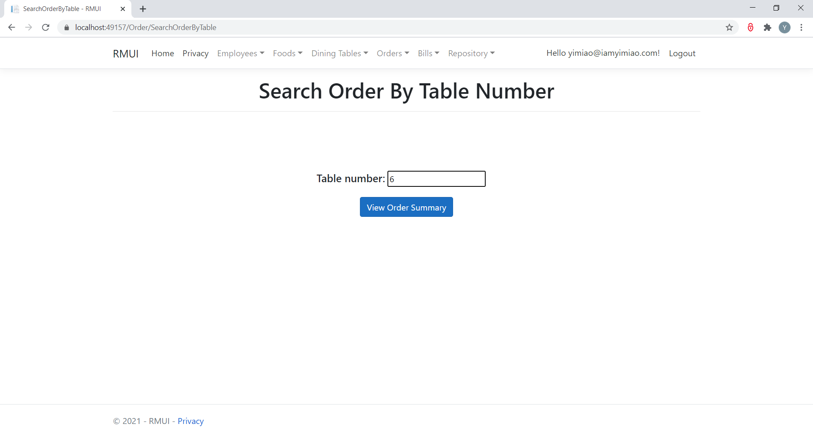

<h3>An error message will show up if currently there is no active order for the searched table</h3>
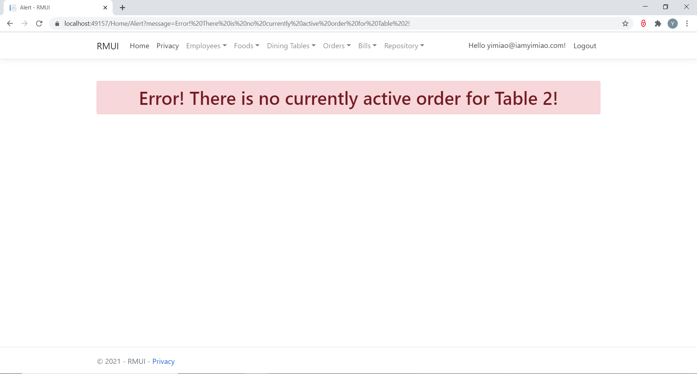

<h3>Order Controller -- viewing the order summary of all active orders. The Create New Order link, Edit link, Details link and Delete link allows inserting new order, editing order summary, viewing ordered food details and deleting order summary respectively.
</h3>
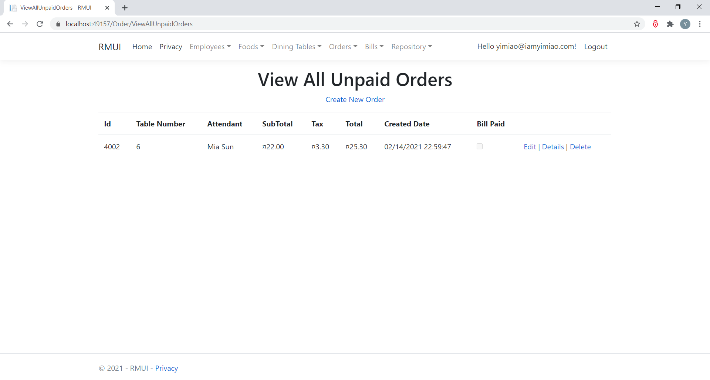

<h3>Order Controller -- editing order summary</h3>
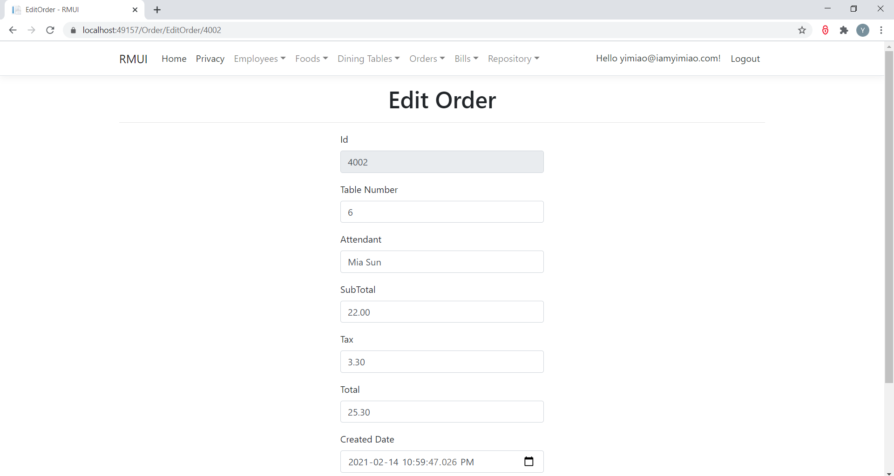

<h3>Order Controller -- viewing ordered food details of a specific table. The Create New Order link, Edit link, Details link and Delete link allows inserting new order, editing ordered food, viewing ordered food and deleting ordered food respectively.
</h3>
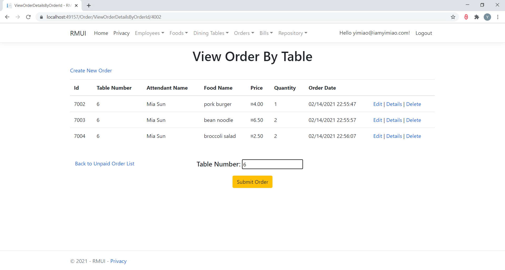

<h3>Bill Controller -- searching the bill of a specific table. An error message will show up if the searched table doesn't exist or currently there is no active order for the searched table.
</h3>
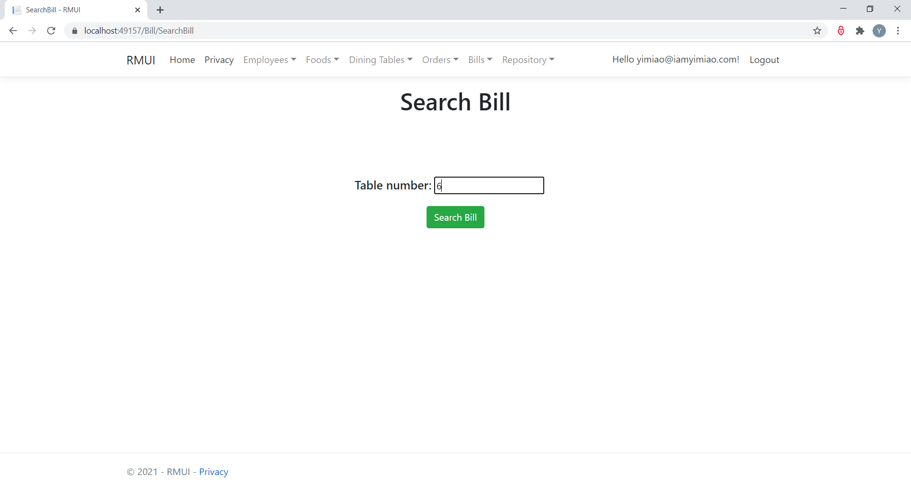

<h3>Bill Controller -- viewing the bill details returned by bill search. If there is no question about the bill we can press the Pay Bill button to request bill payment. The Back To Unpaid Order List link allows redirecting to the summary of all active orders view.</h3>
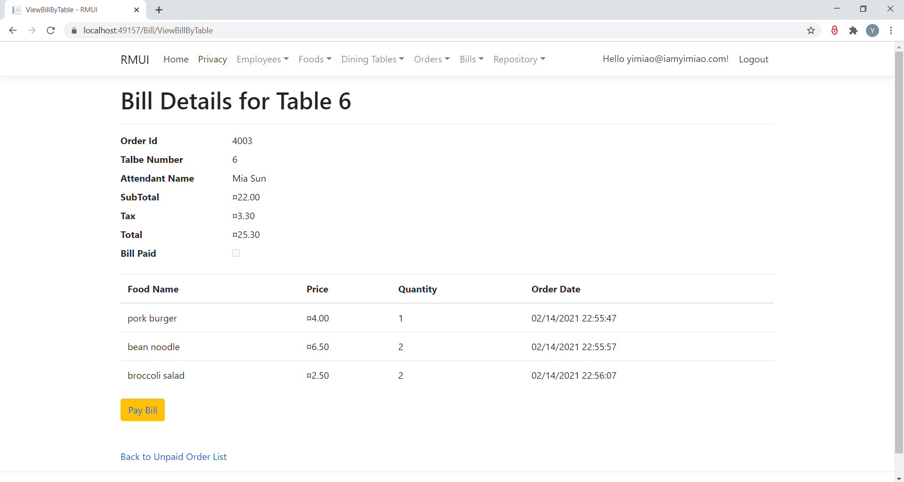

<h3>Repository Controller -- viewing the order summary of all paid and unpaid orders.</h3>
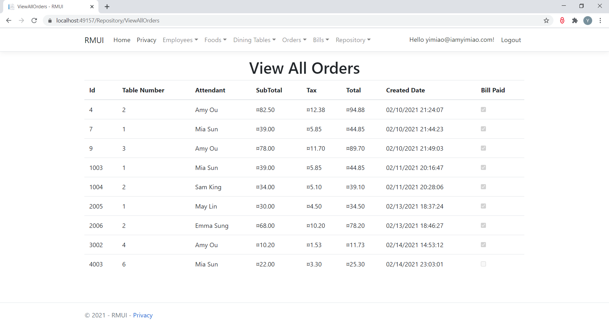

<h3>Repository Controller -- viewing the ordered food details of all paid and unpaid orders.</h3>
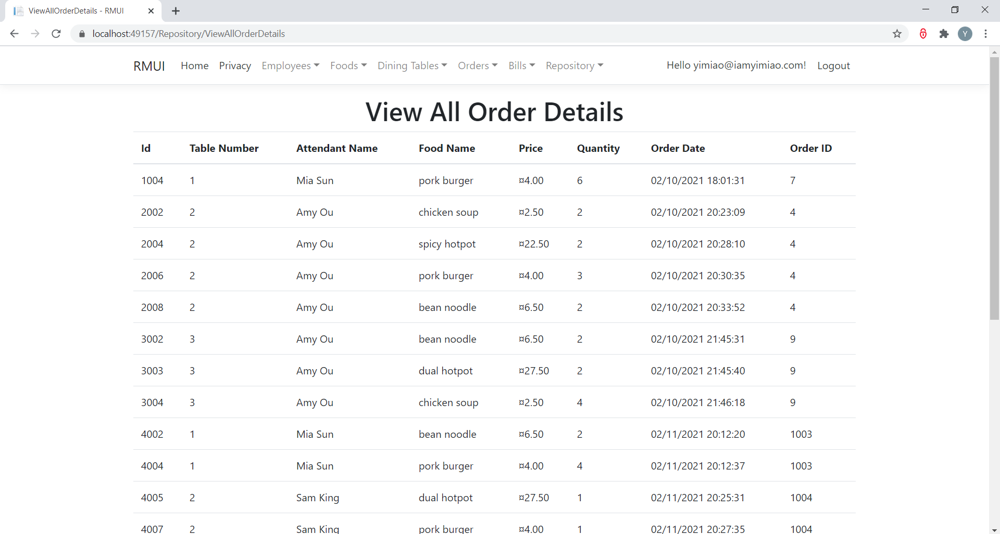

<h3>Repository Controller -- The Order ID for the ordered food of a specific dining table is 0 before bill payment.</h3>
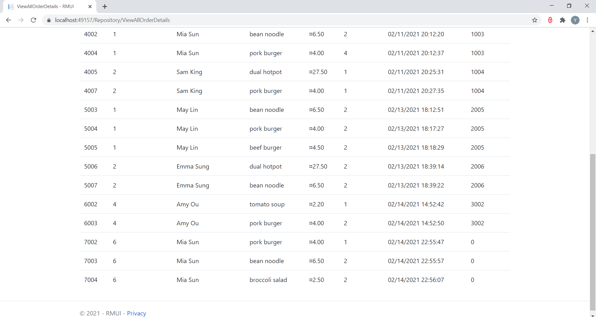

<h3>The dining table's Order ID will be assigned to each of its ordered food after bill payment.</h3>
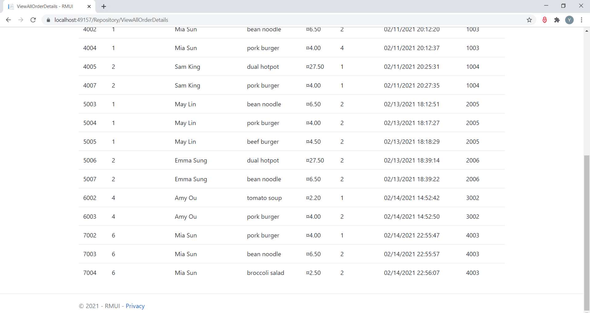

<h3>Data retrieved from SQL database and cached only when it is not in Redis (First retrieval of data from SQL database and caching in Redis at 48th minute).</h3>
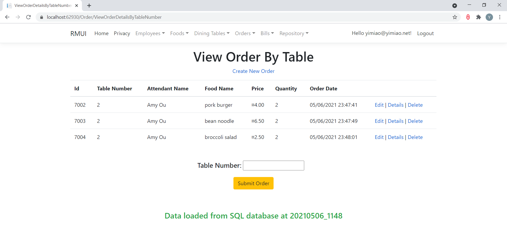

<h3>Data primarily retrieved from Redis if it is cached there (Data is cached in Redis at 49th minute).</h3>
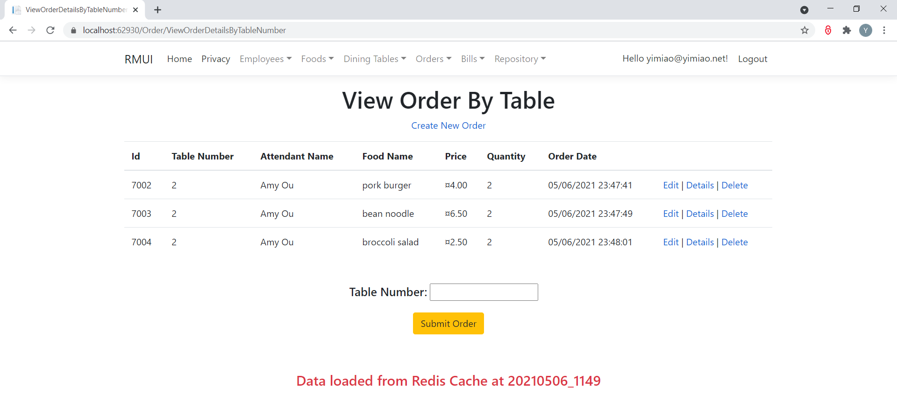

<h3>Data retrieved from SQL database again because it is not cached in Redis (Data cached in Redis for 1 minute and expired at 50th minute).</h3>
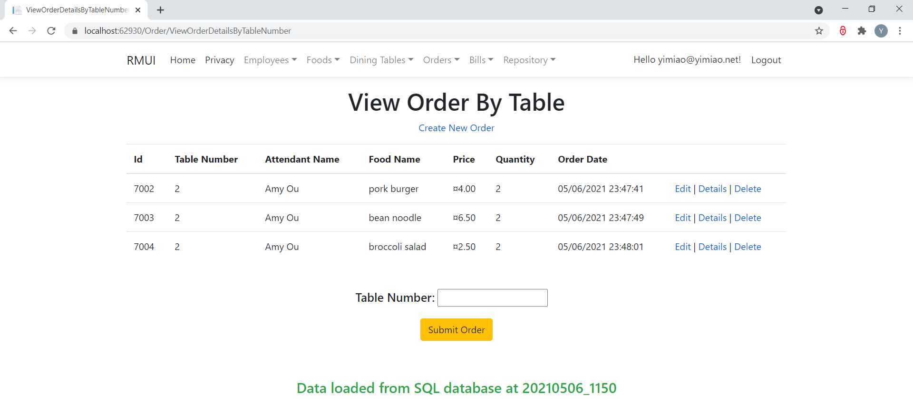
