# Docker Containerized Restaurant Management App (C# .NETCore)
<ul>
  <li>A Docker Containerized Web Application that allows users to manage employees, dining tables, foods, orders and bills in the restaurant with authentication and authorization.</li>
  <li>The app was built with ASP.NET Core3.1 MVC with front-end Views created by Razor Page and Controllers implemented with Dependency Injection and Async/Await.</li>
  <li>Back-end data was managed by Microsoft SQL Server that used Entity Framework Core (EF Core) and Dapper as Object Relational Mapper (ORM) for the  Authentication/Authorization data and the rest of the app data respectively.</li>
</ul>

<h3> Home Page with controllers shown as dropdown lists in the menu bar </h3>
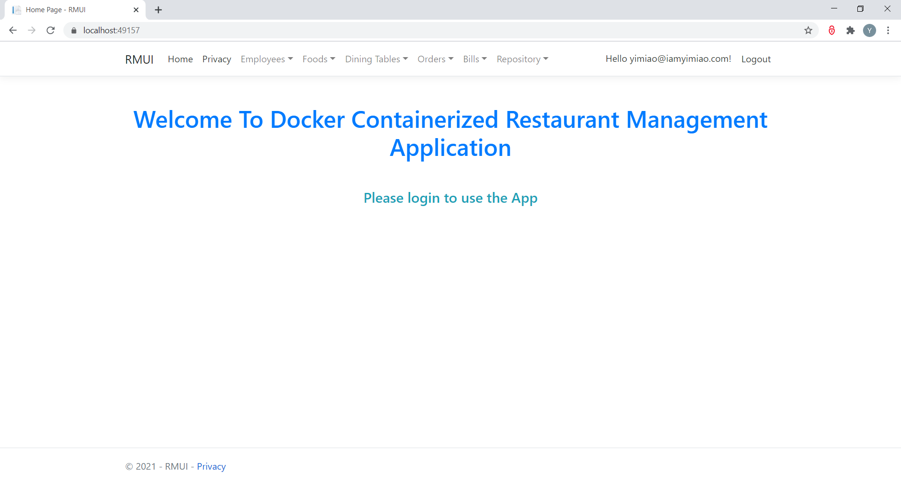

<h3>The app supports Authentication and Authorization, which requires user login to use the app. The code for user role assignment can be found in Home Controller.</h3>
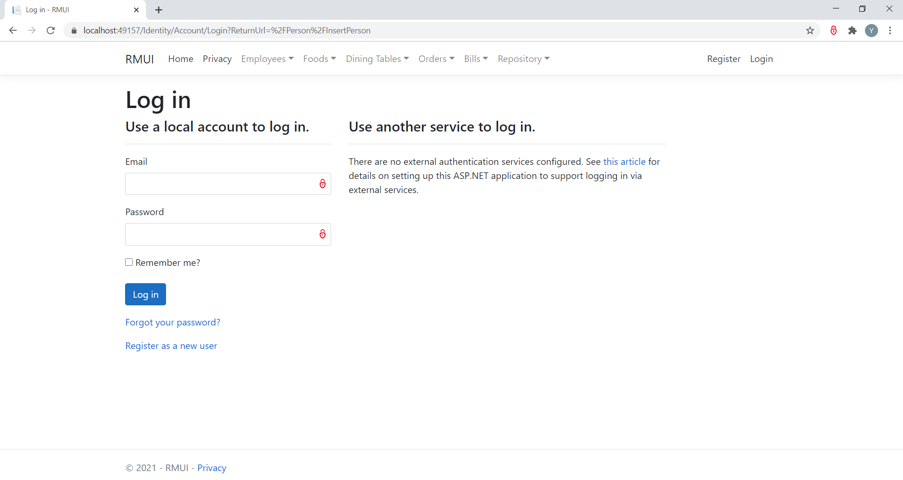

<h3>Person Controller -- inserting new employee into database</h3>
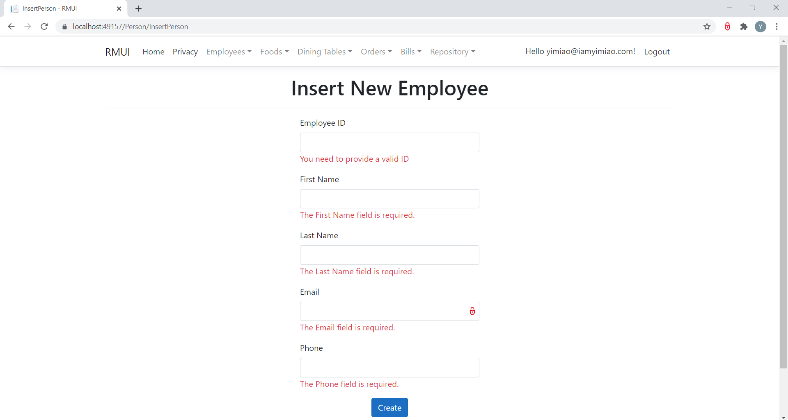

<h3>Person Controller -- editing employee info</h3>
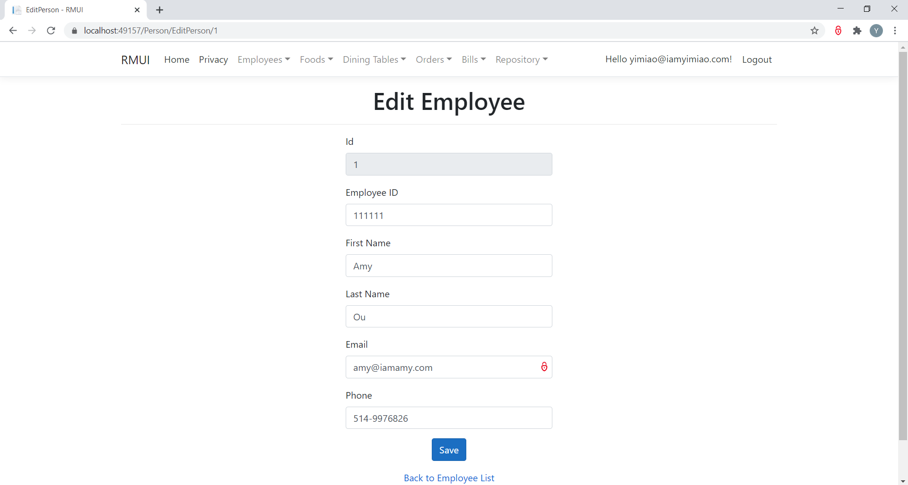

<h3>Person Controller -- viewing all employees. The Create New Employee link and the Edit link allows redirecting to the inserting new employee view and the editing employee view respectively. The Delete link directly deletes the employee.</h3>

<h3>DiningTable Controller -- inserting new dining table into database, with link redirecting to viewing all dining tables view.</h3>

<h3>DiningTable Controller -- editing dining table, with link redirecting to viewing all dining tables view.</h3>
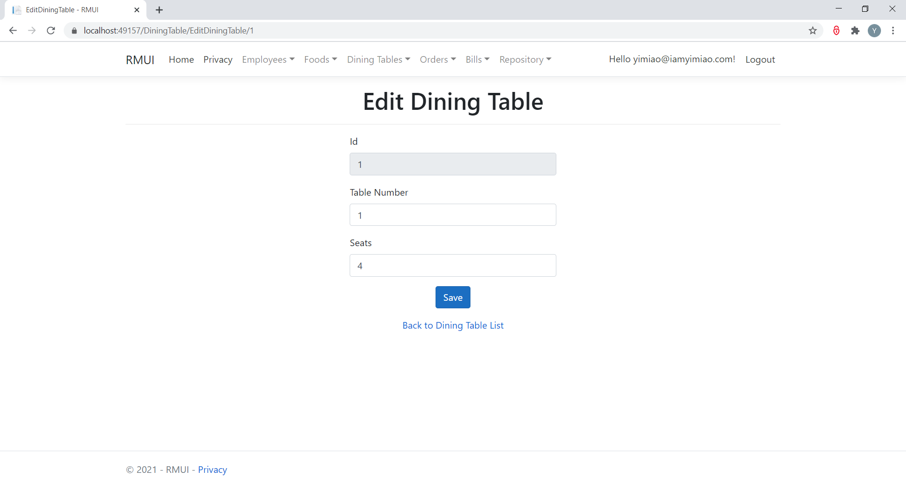

<h3>DiningTable Controller -- viewing all dining tables. The Create New Dining Table link, Edit link and Delete link allows inserting, editing and deleting the dining table respectively.</h3>
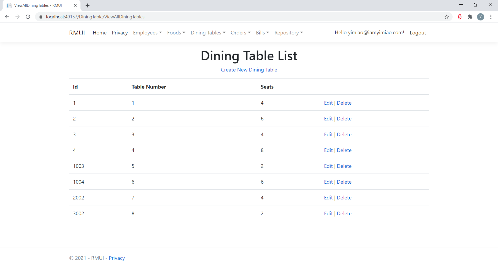

<h3>Food Controller -- inserting new food type into database, with link redirecting to viewing all food types view.</h3>
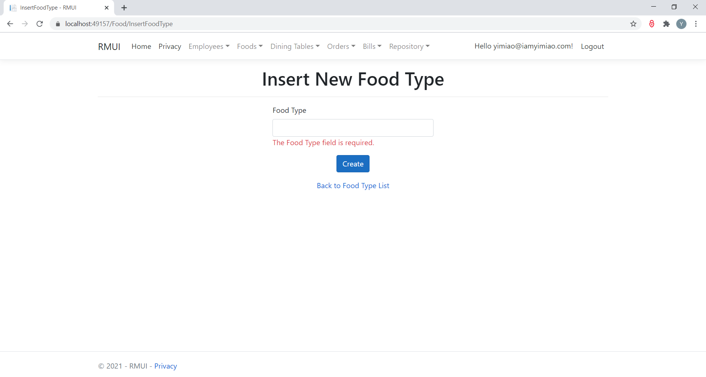

<h3>Food Controller -- viewing all food types. The Create New link redirects to inserting food type view and the Delete link directly deletes the food type.</h3>
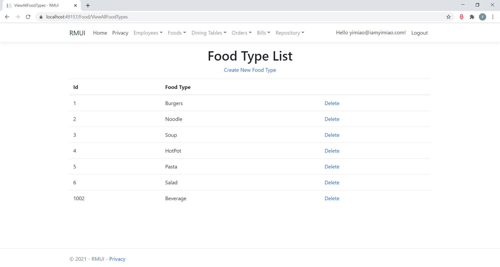

<h3>Food Controller -- inserting new food into database, with link redirecting to viewing all foods view.</h3>
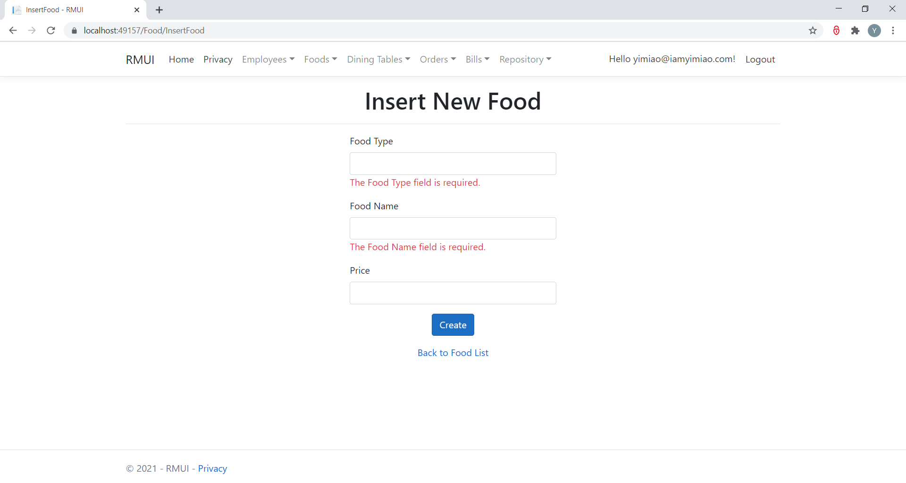

<h3>Food Controller -- viewing all foods, with each food belongs to a specific food type. The Create New Food link, Edit link and Delete link allows inserting new food, editing food and deleting food respectively.</h3>
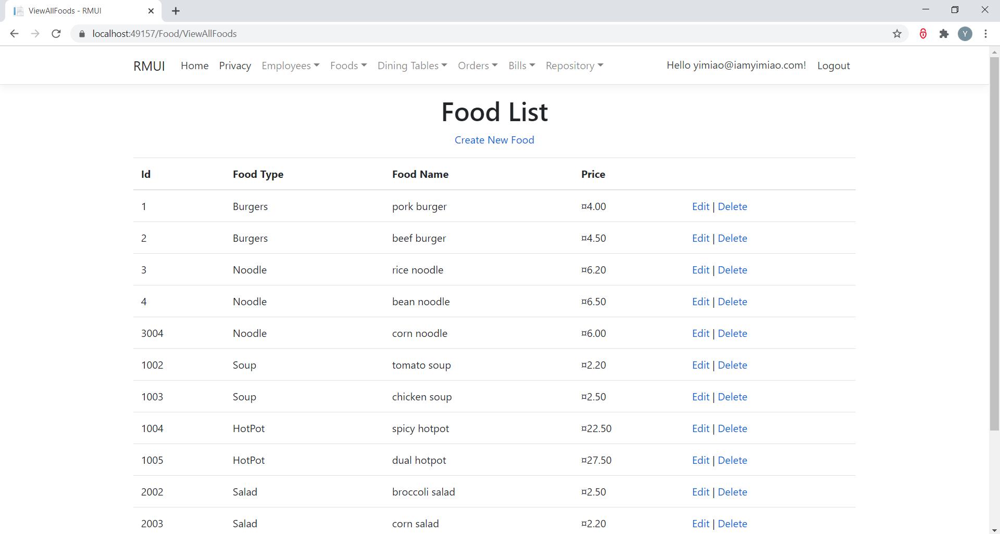

<h3>Food Controller -- editing food, with link redirecting to viewing all foods view.</h3>
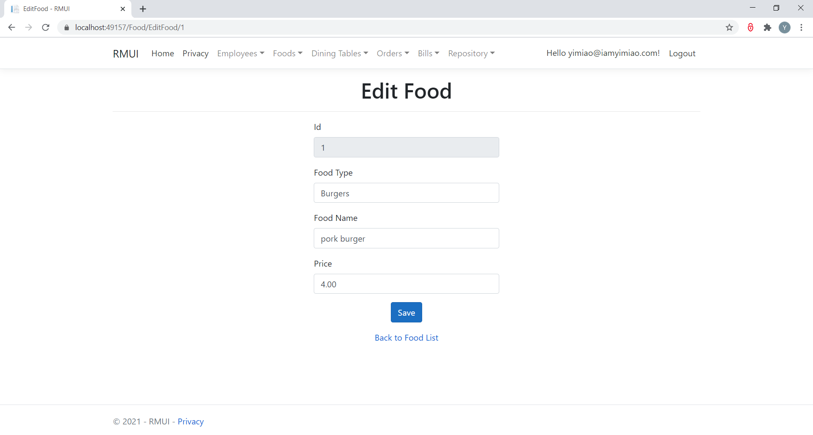

<h3>Order Controller -- inserting new food order for a specific dining table. The table number and attendant name can be selected from the dropdown lists. Both the food type list and food name list are cascading dropdowns. A selected food type will trigger foods that belong to this food type to populate in the food name dropdown. When a certain food name is chosen its price will be automatically filled in the price field. The View Order Summary button allows viewing the order details of the provided dining table number.</h3>
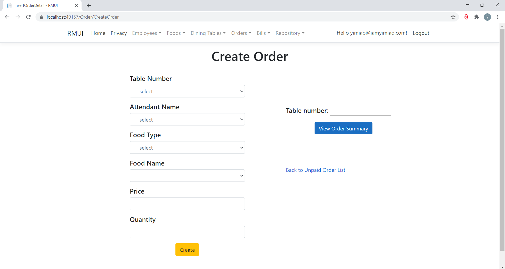

<h3>Order Controller -- viewing the order details of a specific dining table. In addition to the above View Order Summary request, the Search Order action can also lead to this page. The Create New Order link, Edit link, Details link and Delete link allows inserting new order, editing ordered food, viewing ordered food and deleting ordered food respectively. If there is no question about the order for this specific dining table we can type in the table number and submit the order. The order needs to be submitted again whenever the order details are changed.</h3>
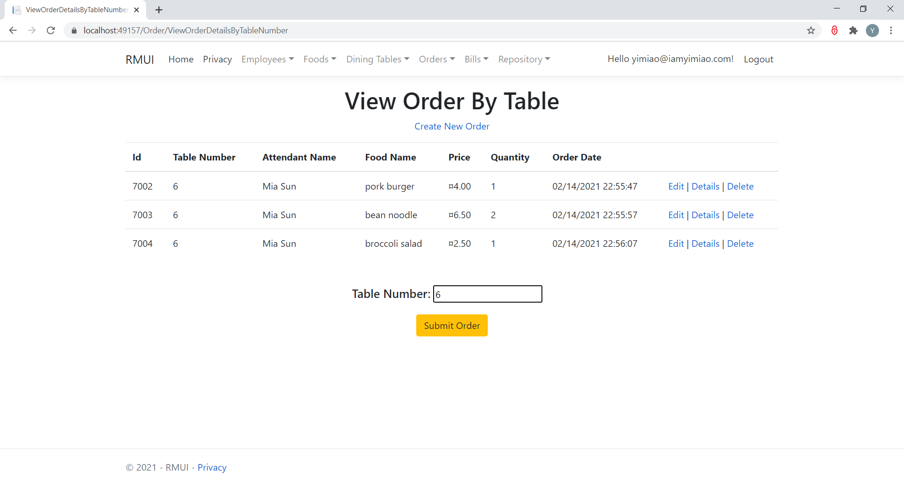

<h3 style="color:blue">Order Controller -- viewing one ordered food of a specific dining table. The Edit link allows editing this ordered food and the Back To Order List link allows redirecting to the order details of the specific dining table.</h3>

<h3 style="color:blue">Order Controller -- editing one ordered food of a specific dining table</h3>
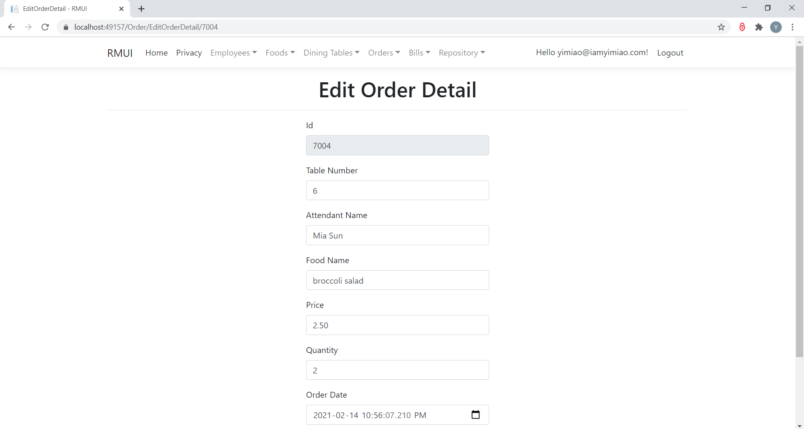

